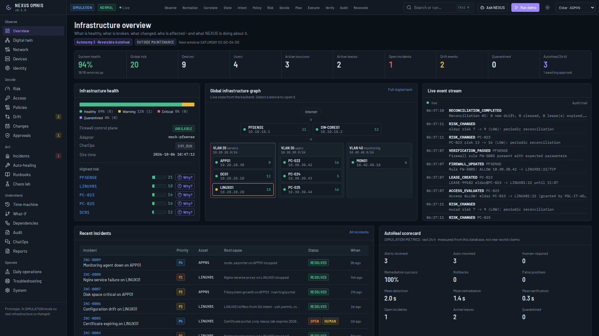
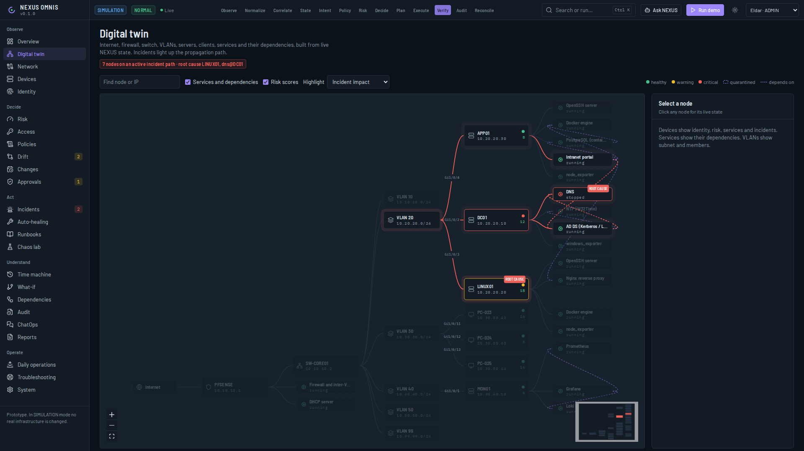
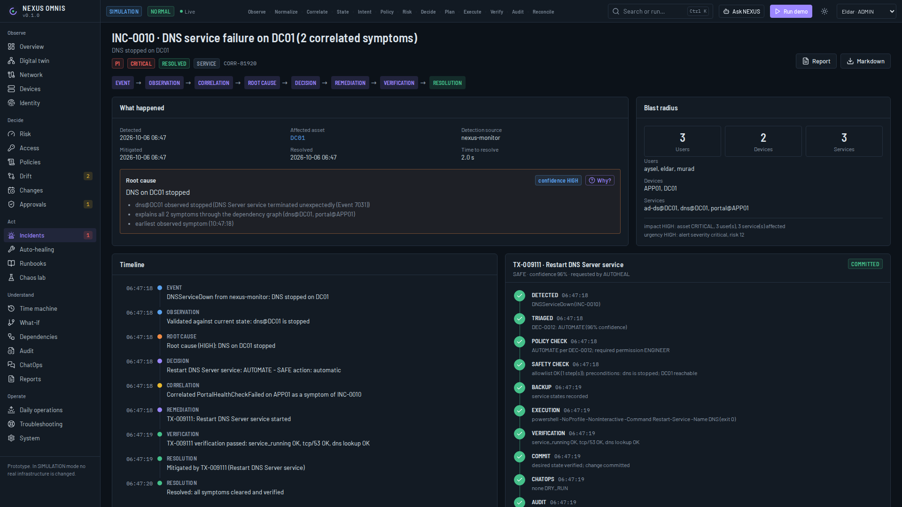
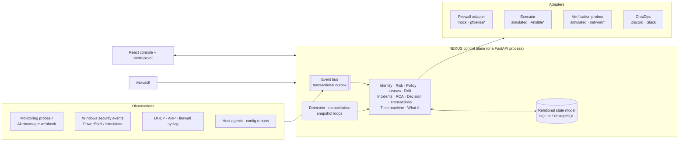

# NEXUS OMNIS

**Network Execution, Unified State & Autonomous Infrastructure Operations Management Intelligence System**

A prototype infrastructure operations control plane. It treats users, devices, networks, services,
configuration, policy, risk and incidents as **one continuously reconciled system**: it observes reality,
compares it with intended state, decides whether reality is acceptable, applies the smallest safe
correction, verifies it, and records everything.

> **Portfolio prototype.** By default everything runs against a simulated enterprise (pfSense, a core switch,
> a domain controller, Linux servers, workstations, six VLANs). Nothing touches real infrastructure unless an
> optional, clearly marked real-lab adapter is configured. It is not production software.



## What it does

```
OBSERVE → NORMALIZE → CORRELATE → UNDERSTAND STATE → COMPARE WITH INTENT → EVALUATE POLICY → CALCULATE RISK
→ DECIDE → PLAN ACTION → EXECUTE SAFELY → VERIFY → AUDIT → RECONCILE
```

The top bar of the console lights each phase of this loop as real events arrive. A concrete run, measured
on this codebase (Chaos Lab → **Break DNS**):

1. The DNS Server service on DC01 stops. NEXUS is *not* told; its monitoring sees it **0.5 s** later.
2. Three symptoms arrive (DNS down, AD logon failures, the intranet portal returning 503). They are correlated
   into **one P1 incident** because the dependency graph shows a single upstream cause.
3. Deterministic root-cause analysis names **DNS on DC01** with HIGH confidence and lists its evidence.
4. The decision engine classifies "restart a verified-down service" as SAFE: automatic at autonomy level 3.
5. The fix runs as a transaction - policy check, safety check, backup, an **allowlisted** `Restart-Service -Name DNS`.
6. Success is not the exit code: NEXUS probes the service, TCP/53 and a real lookup before committing.
7. ChatOps message, audit record, correlation ID linking every step, incident resolved, risk recalculated.



## Quick start

**Docker (Linux, macOS, Windows with Docker Desktop)**

```bash
git clone https://github.com/<you>/nexus-omnis.git
cd nexus-omnis
docker compose up --build
```

Open **http://localhost:8000**. The first start migrates the database, seeds the simulated enterprise and
generates a week of history by running the real engines on a shifted clock (about 5 seconds).

| | Command |
|---|---|
| With Prometheus, Alertmanager, Grafana and Loki | `docker compose --profile observability up --build` (Grafana http://localhost:3000) |
| Windows helper | `.\scripts\start.ps1` (or `-Observability`) |
| Without Docker | `cd backend && pip install -e .` then `nexus-server` (Python 3.11+); build the UI once with `cd frontend && npm ci && npm run build` |
| Frontend development | `make dev` - Vite on :5173 proxies `/api` and `/ws` to :8000 |
| API reference | http://localhost:8000/api/docs |

Demo login is enabled by default: the operator switcher in the top bar signs you in as Eldar (ADMIN),
Murad (ENGINEER), Nigar (OPERATOR) or Aysel (VIEWER). Permissions are enforced by the backend - try a chaos
scenario as Aysel and you get `403 requires ENGINEER role`. Copy `.env.example` to `.env` to configure
secrets, API keys, ChatOps webhooks and adapters.

## A 5-10 minute demonstration

Press **Run demo** for the automated 20-scene version (about 60 s, with a presentation panel), or walk through it:

| Time | Steps | What to show |
|---|---|---|
| 0:00 | 1-2 | **Overview** - healthy infrastructure: instrument strip, health distribution, live event stream, the loop strip |
| 0:40 | 3-5 | **Digital twin** → select **LINUX01** → its services and dependencies (Intranet portal depends on Nginx, AD DS, PostgreSQL) |
| 1:30 | 6-8 | **Identity** → Eldar's identity chain: AD user → group → PC-023 → IP → MAC → VLAN → switch port → lease, at 100% confidence |
| 2:10 | 9-10 | **Access** → active SSH lease; **Explain decision** for Eldar → LINUX01:22 (ALLOW) and Aysel → LINUX01:22 (explicit deny in POL-FINANCE) |
| 3:00 | 11-18 | **Chaos lab** → **Kill Nginx** → watch alert → incident → AutoHeal → `systemctl restart nginx` → verification (systemd + TCP/443 + HTTP 200) → ChatOps message |
| 4:15 | 19-23 | **Break SSH config** → **Drift**: desired vs actual, real diff, SHA-256 mismatch → risk rises → REVERSIBLE fix (91%) → verified → rollback stays available on **Auto-healing** |
| 5:30 | 24-28 | **Create unknown device** → identity confidence collapses → risk passes 80 → SECURITY-004 quarantine to VLAN 99 → incident timeline |
| 6:45 | 29-30 | **Time machine** → rewind to before the quarantine; compare then vs now |
| 7:30 | 31-33 | **What-if** → VLAN 30 fails: 3 devices, 3 users, 2 leases affected - read-only |
| 8:15 | 34-36 | **Run full infrastructure blackout** → nine faults, correlation, EMERGENCY mode, dependency-ordered remediation → open the final report |

Talking points for each act are in [docs/operations/quick-start.md](docs/operations/quick-start.md).



## What the console answers

| Question an engineer asks | Where |
|---|---|
| What is healthy? What is broken? | Overview, Devices, Digital twin, Daily operations |
| Why did it happen? | Incident root cause with evidence and a **Why?** drawer on every decision |
| Who is affected? | Blast radius on each incident; What-if; Dependencies |
| What changed? | Drift (Git intent vs actual), Audit, Time machine, `What changed on LINUX01 today?` in Ask NEXUS |
| What is NEXUS doing, and did the fix work? | Auto-healing transactions: steps, commands, verification probes |
| Can I roll it back? | Rollback on reversible transactions; automatic rollback when verification fails |
| What will happen if I change something? | Change impact analyzer, What-if, policy simulation |
| What happened five minutes ago? | Time machine (snapshot reconstruction and diff) |

## Architecture


`*` optional real-lab adapters, not used by the demo. Details: [docs/architecture/architecture.md](docs/architecture/architecture.md),
12 Mermaid diagrams in [docs/diagrams](docs/diagrams), 11 decision records in [docs/adr](docs/adr).

**Stack:** Python 3.12, FastAPI, Pydantic, SQLAlchemy 2, Alembic, WebSockets · React 18, TypeScript, Vite,
Tailwind, React Flow, Recharts · Docker, Prometheus, Alertmanager, Grafana, Loki · Ansible, PowerShell · GitHub Actions.

## What is simulated and what is real

| Area | Default (SIMULATION) | Real-lab path | Status |
|---|---|---|---|
| Firewall | Mock pfSense ruleset in the database | `PfSenseAdapter` (pfSense REST API v2) | Implemented, **not tested against a live pfSense** |
| Identity | Simulated AD (users, groups, computers, sessions) | `Get-NexusADInventory.ps1` / `Get-NexusSecurityEvents.ps1` push to the ingest API | Scripts parse-checked with PowerShell 7; not run against a live AD here |
| Remediation | Simulated executor applying allowlisted operations | `AnsibleExecutor` → `ansible/playbooks/remediate.yml` | Playbooks pass `ansible-playbook --syntax-check` |
| Verification | Probes against the simulated hosts | `NetworkProbes` (real TCP connect, HTTP GET) | Implemented |
| Monitoring | Internal detector | Prometheus rules → Alertmanager → `/api/alerts/alertmanager` | Rules and config validated with promtool / amtool |
| Config observation | Simulated host agents | `ansible/roles/nexus-agent` → `/api/ingest/config-report` | Implemented |

NEXUS never claims a simulated change touched real infrastructure: every page shows the environment, and
a firewall outage yields **PENDING**, never SUCCESS.

## Safety model in one paragraph

Alert content is never executed. Every action is a catalogued template with validated parameters (no shell).
SAFE actions run automatically; REVERSIBLE ones only above an evidence-based confidence threshold; HIGH_IMPACT
and CRITICAL ones need approval from someone other than the requester. Duplicate, loop, mass-change,
protected-asset, change-window and lockout guards apply to every decision. Each change is backed up, verified
against the real end state and rolled back if verification fails. See
[docs/security/security-model.md](docs/security/security-model.md) and the
[threat model](docs/security/threat-model.md).

## Quality

- **48 backend tests** asserting behaviour end to end: correlation into one incident, rollback despite exit code 0,
  quarantine isolation verified by policy test, the read-only what-if, RBAC, webhook validation, rate limits.
- **6 frontend unit tests**; strict TypeScript; ruff (with bandit-style security rules) and mypy clean.
- **CI** (GitHub Actions): lint, type check, tests, `pip-audit`, frontend build, promtool/amtool/Ansible checks,
  and a Docker build that boots the image and probes `/health`. See [docs/testing.md](docs/testing.md).

## Command line

```bash
nexusctl status
nexusctl explain access eldar PC-023 LINUX01 22
nexusctl chaos run unknown-device
nexusctl whatif vlan_down vlan=30
nexusctl demo            # 20-scene guided demo in the terminal
nexusctl demo blackout   # prints the final incident report
```
Inside Docker: `docker compose exec nexus nexusctl status`. Full reference: [docs/guides/cli.md](docs/guides/cli.md).

## Repository layout

```
backend/nexus/   api · core · models · database · events · identity · network · firewall · policy · risk · drift
                 remediation · incidents · leases · dependencies · whatif · timemachine · chatops · monitoring
                 simulation · chaos · operations · cli
backend/tests/   pytest suite          frontend/src/   pages · components · graph · charts · api · hooks
policies/        policy as code        baselines/      Git intent per host        runbooks/   operator runbooks
simulation/      the fictional enterprise              ansible/ · powershell/     real-lab automation
prometheus/ alertmanager/ grafana/ loki/   observability stack      docs/   architecture, guides, ADRs
```

## Publishing to GitHub

```bash
git init && git add . && git commit -m "NEXUS OMNIS v0.1.0"
gh repo create nexus-omnis --public --source . --push      # or: git remote add origin <url> && git push -u origin main
```
Then add topics (`infrastructure-automation`, `self-healing`, `fastapi`, `react`, `network-automation`,
`devops`, `sre`), pin the repository, and let the CI badge go green. The screenshots in `docs/screenshots`
were captured from this build.

## Documentation

[Installation](docs/operations/installation.md) · [Quick start & talking points](docs/operations/quick-start.md) ·
[Operations guide](docs/operations/operations-guide.md) · [Simulation](docs/operations/simulation-guide.md) ·
[Chaos lab](docs/operations/chaos-lab-guide.md) · [Policies](docs/operations/policy-guide.md) ·
[Drift](docs/operations/drift-guide.md) · [Remediation](docs/operations/remediation-guide.md) ·
[ChatOps](docs/operations/chatops-guide.md) · [API](docs/guides/api.md) · [CLI](docs/guides/cli.md) ·
[AD](docs/integrations/ad-integration.md) · [pfSense](docs/integrations/pfsense-integration.md) ·
[Ansible](docs/integrations/ansible-integration.md) · [Monitoring](docs/integrations/monitoring-integration.md) ·
[Real lab](docs/integrations/real-lab-deployment.md) · [Troubleshooting](docs/troubleshooting/project-troubleshooting.md) ·
[CV summary](docs/cv-project-summary.md) · [Interview questions](docs/interview-questions.md)

## Limitations

Single-node prototype: one control-plane process, an in-process event bus and SQLite by default
(PostgreSQL works through `DATABASE_URL`). Identity confidence and risk weights are configurable prototype
heuristics, not statistical models. Root-cause analysis is deterministic and limited to what the dependency
graph and recorded changes can explain. Real-lab adapters are optional and were not exercised against live
equipment in this repository. Demo login must be disabled (`NEXUS_DEMO_AUTH=false`) for anything shared.

## License

MIT - see [LICENSE](LICENSE). All people, hosts and data in the simulation are fictional.
